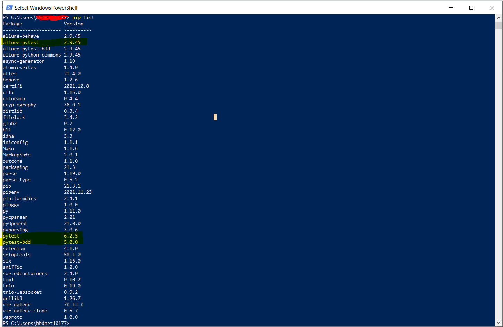
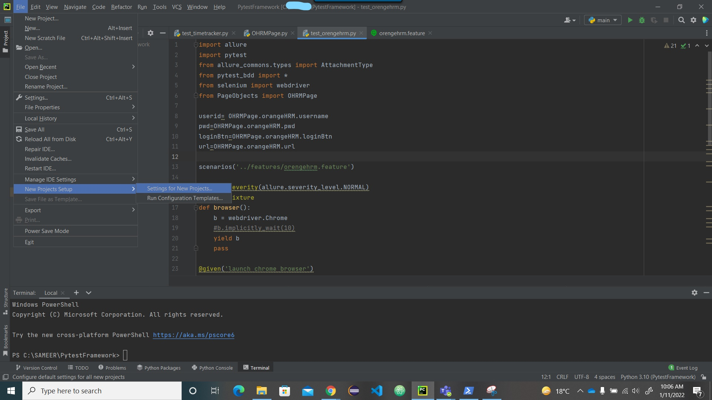
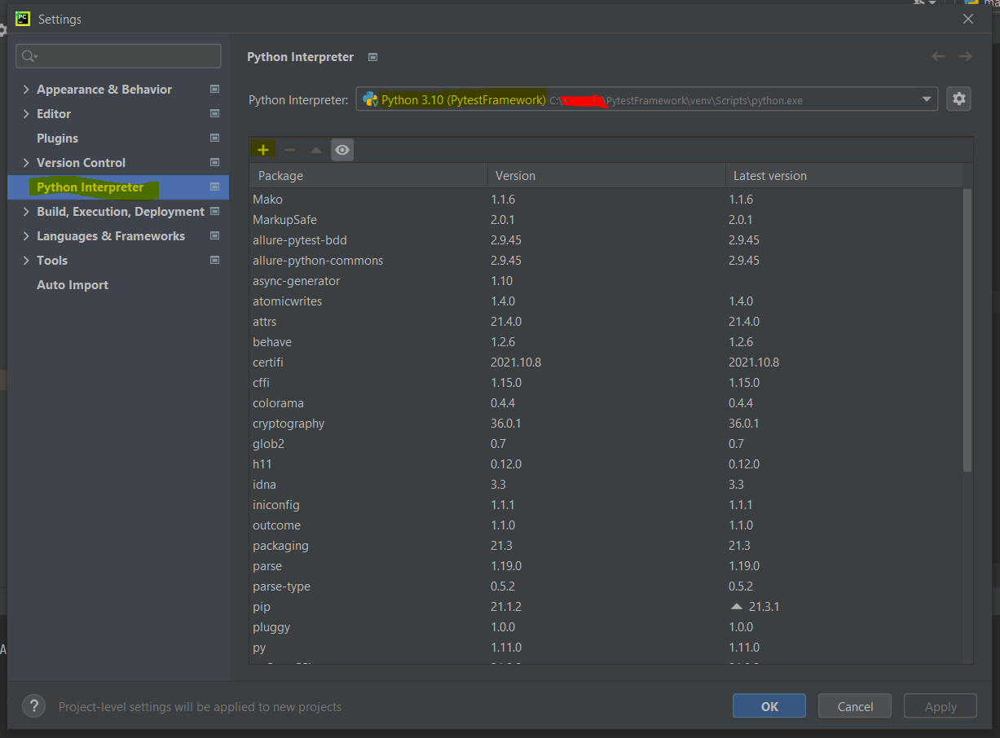
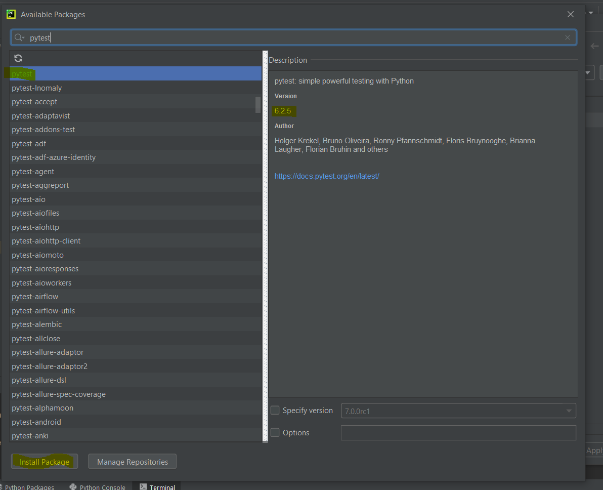
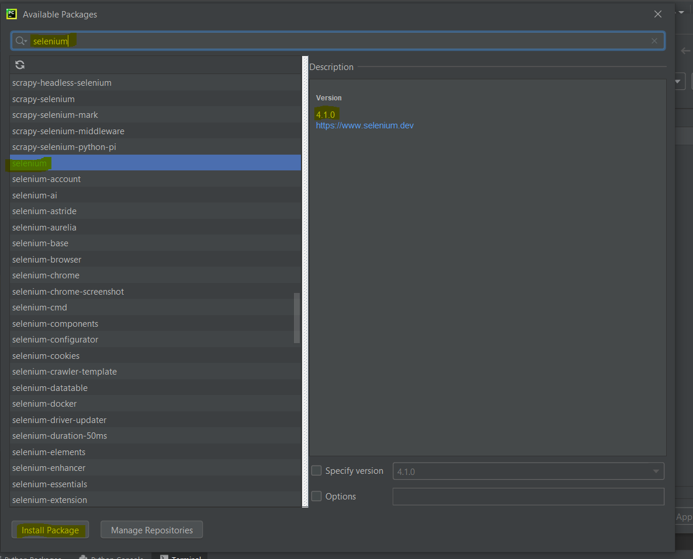
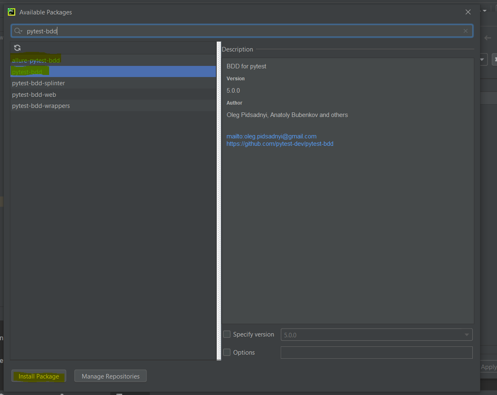

# Pytest
Pytest test automation framework for bbd internal use

- [Pytest](#pytest)
  - [installtion Tools and Softwares](#installtion-tools-and-softwares)
  - [Test Run](#test-run)
  - [Documentation](#documentation)

## installtion Tools and Softwares

 * Download Python by using this link and install in sysytem
    
    [Click here for Python](https://www.python.org/downloads/)
    
 * To install pytest in system use following command
    
    ```
    pip install -U pytest
    ```
   
 * To install pytest-bdd use following command
  
    ```
    pip install pytest-bdd
    ```
 
 * To check packages are install in system use command

    ```
    pip list
    ````
    
    
    
 * To install pycharm IDE in system click on following link
  
    [Click here to download pycharm IDE](https://www.jetbrains.com/pycharm/download/#section=windows)
        
 * After creating project directory of pytest make some following changes in pycharm IDE

    
    
    select python interpreter and click on (+) icon to add packages for project level
    
    
    
 * Install pytest for project by typing keyword pytest in search box
    
    
    
 * Install selenium for project by typing keyword selenium in search box

    
    
 * Install pytest-bdd and allure-pytest-bdd for project 
    
    
    
    After successfully install all packages just save and exit window
    
 * Install selenium webdriver go to following link and download as per your browser version
    
    [Click here to download Webdriver](https://www.selenium.dev/downloads/)
    
    After downlad webdriver successfully place it in ``C:\Program Files\Python310\Scripts`` folder
    
## Test Run
 
 * To run tests, run the following command in Command in terminal
  
    ```
    pytest tests/step_defs
    ```
 * To run test with allure report use following command
    
    ```
    pytest --alluredir=report_allure/ tests/step_defs
    ```
    
## Documentation

  * [Pytest](https://docs.pytest.org/en/6.2.x/)
  * [Pytest-bdd](https://automationpanda.com/2018/10/22/python-testing-101-pytest-bdd/)
  * [Pytest-allure](https://docs.qameta.io/allure-report/frameworks/python/pytest)
    
